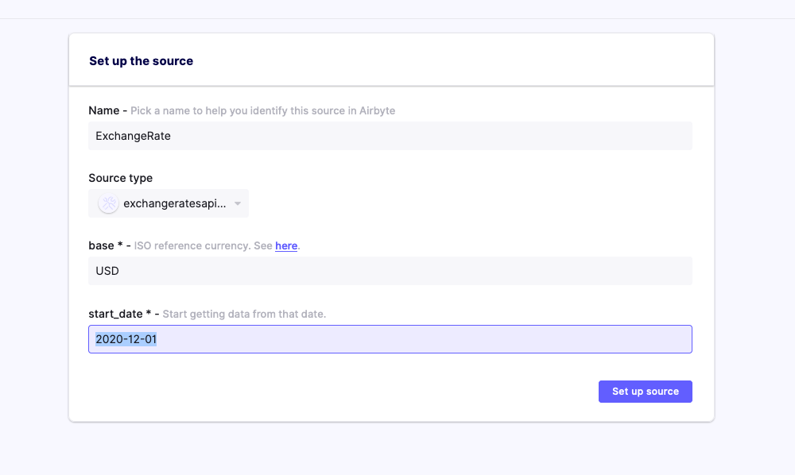
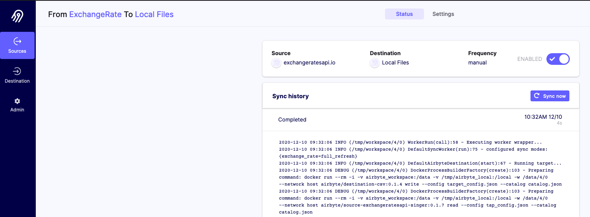
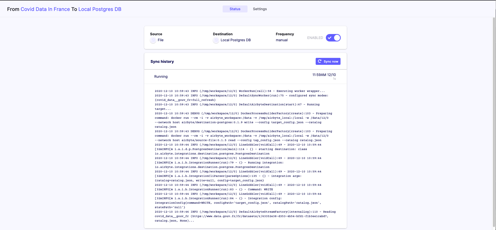

# Airbyte Configuration Persistence Tutorial

Once you manage to spin up a local instance of Airbyte, following steps in the [Getting started Tutorial](../getting-started-tutorial.md), you may want to gain a better understanding of what configuration files are available in Airbyte and how to work with it.

This tutorial will go over importing and exporting Airbyte configurations of connectors which may be useful if you need for example to version control, share with your team or if you just want to debug things.

Here are the goals for this tutorial:
1. Access to replication logs files 
2. Export & Import Airbyte Configuration data files
3. Export normalization models to use in your own DBT project

## Setting up a local Postgres Destination

For this tutorial, we are going to use 2 types of destinations to run our demo where data will be written:
- Local File Destination
- Local Postgres Database

The local files will be written to the directory `/tmp/airbyte_local`.

The postgres database that we are going to spin up below will be running locally with the following configuration where data will be written:

    - Host: localhost
    - Port: 3000
    - User: postgres
    - Password: password
    - DB Name: postgres


```bash
echo "File Content in the local destination (may not exist yet):"
find /tmp/airbyte_local

echo ""

docker ps | grep -q local-airbyte-postgres-destination
if [ $? -eq 0 ]; then
    echo "Postgres Database local-airbyte-postgres-destination is already up"
else 
    echo "Start a Postgres container named local-airbyte-postgres-destination"
    docker run --rm --name local-airbyte-postgres-destination -e POSTGRES_PASSWORD=password -p 3000:5432 -d postgres
fi

echo ""

echo "Docker Containers currently running:"

docker ps
```

    File Content in the local destination (may not exist yet):
    find: /tmp/airbyte_local: No such file or directory
    
    Start a Postgres container named local-airbyte-postgres-destination
    5a1970daa0f58f7e7ab4f04894b19f57a31f850f8c60e8a9afba3d0b26886caa
    
    Docker Containers currently running:
    CONTAINER ID        IMAGE               COMMAND                  CREATED             STATUS                  PORTS                    NAMES
    5a1970daa0f5        postgres            "docker-entrypoint.s…"   1 second ago        Up Less than a second   0.0.0.0:3000->5432/tcp   local-airbyte-postgres-destination


## Starting Airbyte Server

As we've seen in the previous tutorial, we can spin up Airbyte instance after installing it:


```bash
# Check if airbyte is installed
docker-compose config &> /dev/null
if [ $? -ne 0 ]; then
    git clone https://github.com/airbytehq/airbyte.git
    cd airbyte
fi 

docker-compose up -d

echo -e "\n"

echo "Docker Containers currently running:"
docker ps
```

    WARNING: The API_URL variable is not set. Defaulting to a blank string.
    Creating network "airbyte_default" with the default driver
    Creating volume "airbyte_workspace" with default driver
    Creating volume "airbyte_data" with default driver
    Creating volume "airbyte_db" with default driver
    Creating init ... 
    Creating airbyte-data-seed ... 
    Creating airbyte-db        ... 
    Creating airbyte-server    ... mdone
    Creating airbyte-scheduler ... 
    Creating airbyte-webapp    ... mdone
    ting airbyte-webapp    ... done
    
    Docker Containers currently running:
    CONTAINER ID        IMAGE                           COMMAND                  CREATED             STATUS                  PORTS                              NAMES
    60d258fa4f28        airbyte/webapp:0.7.0-alpha      "/docker-entrypoint.…"   1 second ago        Up Less than a second   0.0.0.0:8000->80/tcp               airbyte-webapp
    9feab538a50d        airbyte/scheduler:0.7.0-alpha   "/bin/bash -c './wai…"   2 seconds ago       Up Less than a second                                      airbyte-scheduler
    bcd76af9a79d        airbyte/server:0.7.0-alpha      "/bin/bash -c './wai…"   2 seconds ago       Up Less than a second   8000/tcp, 0.0.0.0:8001->8001/tcp   airbyte-server
    297ba926ca74        airbyte/db:0.7.0-alpha          "docker-entrypoint.s…"   2 seconds ago       Up 1 second             5432/tcp                           airbyte-db
    5a1970daa0f5        postgres                        "docker-entrypoint.s…"   7 seconds ago       Up 6 seconds            0.0.0.0:3000->5432/tcp             local-airbyte-postgres-destination


Note that if you already went through the previous tutorial or already used Airbyte in the past, you may not need to complete the Onboarding process this time.

Otherwise, please complete the different steps until you reach the Airbyte Dashboard page.

After a few seconds, the UI should be ready to go at http://localhost:8000/.

## Notes about running this tutorial on Mac OS vs Linux

Note that the commands in this tutorial will vary greatly depending on if you are running a Mac OS or Linux Operation System.

Docker for Mac is not a real Docker host, now it actually runs a virtual machine behind the scenes and hides it from you to make things simpler. 
Simpler, unless you want to dig deeper... just like our current use case where we want to inspect the content of internal Docker volumes...

Here are some related links as references on accessing Docker Volumes on Mac OS:
- [Screen + tty in 2017 (deprecated?)](https://timonweb.com/docker/getting-path-and-accessing-persistent-volumes-in-docker-for-mac/)
- [Using Docker containers in 2019](https://stackoverflow.com/a/55648186)

From these discussions, we will be using on Mac OS either:
1. any docker container/image to browse the virtual filesystem by mounting the volume in order to access them, for example with [busybox](https://hub.docker.com/_/busybox)
2. or extract files from the volume by copying them onto the host with [Docker cp](https://docs.docker.com/engine/reference/commandline/cp/)

Therefore, below commands will provide versions that should work for both Mac OS and Linux.

On Linux, accessing to named Docker Volume can be easier since you simply need to:
    
    docker volume inspect <volume_name>
    
Then look at the "Mountpoint" value, this is where the volume is actually stored and you can directly retrieve files directly from that folder.

## Export Initial Setup

Now let's first make a backup of the configuration state of your Airbyte instance by running the following commands.


```bash
mkdir -p $TUTORIAL_DIR/my-setup

docker cp airbyte-server:/data $TUTORIAL_DIR/my-setup
```

## Configure some Exchange Rate source and File destination

Head back to http://localhost:8000/ and add more connectors. 
Here is an example of configuration from an API source:



and a local file destination:


## Run a Sync job

- once the source and destination are created
- the catalog and frequency can be configured
- then run the "Sync Now" button
- finally inspect logs in the UI



## Exploring Logs folders

We can read from the lines reported in the logs the working directory that is being used to run the synchronization process from.

As an example in the previous run, it is being ran in `/tmp/workspace/4/0` and we notice the different docker commands being used internally are starting with:

    docker run --rm -i -v airbyte_workspace:/data -v /tmp/airbyte_local:/local -w /data/4/0 --network host ...

From there, we can observe that Airbyte is using a docker named volume called `airbyte_workspace` that is mounted in the container at the location `/data`.

Following [Docker Volume documentation](https://docs.docker.com/storage/volumes/), we can inspect and manipulate persisted configuration data in these volumes.
For example, we can run any docker container/image to browse the content of this named volume by mounting it in a similar way, let's use the [busybox](https://hub.docker.com/_/busybox) image.

    docker run -it --rm --volume airbyte_workspace:/data busybox

This will drop you into an `sh` shell to allow you to do what you want inside a BusyBox system from which we can browse the filesystem and accessing to logs files:

    ls /data/4/0/

Which should output:

    catalog.json                  normalize                     tap_config.json
    logs.log                      singer_rendered_catalog.json  target_config.json

Or you can simply run:


```bash
docker run -it --rm --volume airbyte_workspace:/data busybox ls /data/4/0
```

    catalog.json                  singer_rendered_catalog.json
    logs.log                      tap_config.json
    normalize                     target_config.json


```bash
docker run -it --rm --volume airbyte_workspace:/data busybox cat /data/4/0/catalog.json 
```

    {"streams":[{"stream":{"name":"exchange_rate","json_schema":{"type":"object","properties":{"CHF":{"type":"number"},"HRK":{"type":"number"},"date":{"type":"string"},"MXN":{"type":"number"},"ZAR":{"type":"number"},"INR":{"type":"number"},"CNY":{"type":"number"},"THB":{"type":"number"},"AUD":{"type":"number"},"ILS":{"type":"number"},"KRW":{"type":"number"},"JPY":{"type":"number"},"PLN":{"type":"number"},"GBP":{"type":"number"},"IDR":{"type":"number"},"HUF":{"type":"number"},"PHP":{"type":"number"},"TRY":{"type":"number"},"RUB":{"type":"number"},"HKD":{"type":"number"},"ISK":{"type":"number"},"EUR":{"type":"number"},"DKK":{"type":"number"},"CAD":{"type":"number"},"MYR":{"type":"number"},"USD":{"type":"number"},"BGN":{"type":"number"},"NOK":{"type":"number"},"RON":{"type":"number"},"SGD":{"type":"number"},"CZK":{"type":"number"},"SEK":{"type":"number"},"NZD":{"type":"number"},"BRL":{"type":"number"}}},"supported_sync_modes":["full_refresh"],"default_cursor_field":[]},"sync_mode":"full_refresh","cursor_field":[]}]}

## Check local data folder

Since the job completed successfully, a new file should be available in the special `/local/` directory in the container which is mounted from `/tmp/airbyte_local` on the host machine.


```bash
echo "In the container:"

docker run -it --rm -v /tmp/airbyte_local:/local busybox find /local

echo ""
echo "On the host:"

find /tmp/airbyte_local
```

    In the container:
    /local
    /local/data
    /local/data/exchange_rate_raw.csv
    
    On the host:
    /tmp/airbyte_local
    /tmp/airbyte_local/data
    /tmp/airbyte_local/data/exchange_rate_raw.csv


## Backup Exchange Rate Source and Destination configurations

In the following steps, we will play with persistence of configurations so let's make a backup of our newly added connectors for now:


```bash
mkdir -p $TUTORIAL_DIR/exchange-rate-setup

docker cp airbyte-server:data $TUTORIAL_DIR/exchange-rate-setup
```

## Shutting down Airbyte server and clear previous configurations

Whenever you want to stop the Airbyte server, you can run: `docker-compose down`

From [docker documentation](https://docs.docker.com/compose/reference/down/)
```
This command stops containers and removes containers, networks, volumes, and images created by up.

By default, the only things removed are:

- Containers for services defined in the Compose file
- Networks defined in the networks section of the Compose file
- The default network, if one is used

Networks and volumes defined as external are never removed.

Anonymous volumes are not removed by default. However, as they don’t have a stable name, they will not be automatically mounted by a subsequent up. For data that needs to persist between updates, use host or named volumes.
```

So since Airbyte is using named volumes to store the configurations, if you run 
`docker-compose up` again, your connectors configurations from earlier steps will still be available.

Let's wipe our configurations on purpose and use the following option:

```
-v, --volumes           Remove named volumes declared in the `volumes`
                            section of the Compose file and anonymous volumes
                            attached to containers.
```

Note that the `/tmp/airbyte_local:/local` that we saw earlier is a [bind mount](https://docs.docker.com/storage/bind-mounts/) so data that was replicated locally won't be affected by the next command.

However it will get rid of the named volume workspace so all logs and generated files by Airbyte will be lost.

We can then run:


```bash
docker-compose down -v
docker-compose up -d
```

    WARNING: The API_URL variable is not set. Defaulting to a blank string.
    Stopping airbyte-webapp    ... 
    Stopping airbyte-scheduler ... 
    Stopping airbyte-server    ... 
    Stopping airbyte-db        ... 
    Removing airbyte-webapp    ... mdone
    Removing airbyte-scheduler ... 
    Removing airbyte-server    ... 
    Removing airbyte-data-seed ... 
    Removing airbyte-db        ... 
    Removing init              ... 
    Removing network airbyte_defaultdone
    Removing volume airbyte_workspace
    Removing volume airbyte_data
    Removing volume airbyte_db
    WARNING: The API_URL variable is not set. Defaulting to a blank string.
    Creating network "airbyte_default" with the default driver
    Creating volume "airbyte_workspace" with default driver
    Creating volume "airbyte_data" with default driver
    Creating volume "airbyte_db" with default driver
    Creating init ... 
    Creating airbyte-data-seed ... 
    Creating airbyte-db        ... 
    Creating airbyte-server    ... mdone
    Creating airbyte-scheduler ... mdone
    Creating airbyte-webapp    ... mdone
    ting airbyte-webapp    ... done

Wait a moment for the webserver to start and go refresh the page http://localhost:8000/.

We are prompted with the onboarding process again...

Let's ignore that step, close the page and go back to the notebook to import configurations from our initial setup instead.

## Restore our initial setup

We can play and restore files in the named docker volume `data` and thus retrieve files that were created from earlier:


```bash
docker cp $TUTORIAL_DIR/my-setup/data/config airbyte-server:data
```

Now refresh back the page http://localhost:8000/ again, wait a little bit for the server to pick up the freshly imported configurations...
Tada! We don't need to complete the onboarding process anymore! 
and we have the list of connectors that were created previously available again. Thus you can use this ability of export/import files from named volumes to share with others the configuration of your connectors.

Warning: and it will include credentials, so be careful too!

## Configure some Covid (data) source and Postgres destinations

Let's re-iterate the source and destination creation, this time, with a file accessible from a public API:


And a local Postgres Database:


After setting up the connectors, we can trigger the sync and study the logs:



## Export and customize Normalization step with DBT

In the previous connector configuration, selected a Postgres Database destination and chose to enable the "Basic Normalization" option.

In Airbyte, data is written in destination in a JSON blob format in tables with suffix "_raw" as it is taking care of the `E` and `L` in `ELT`. 

The normalization option adds a last `T` transformation step that takes care of converting such JSON tables into flat tables. 
To do so, Airbyte is currently using [DBT](https://docs.getdbt.com/) to handle such tasks which can be manually triggered in the normalization container like this:


```bash
NORMALIZE_WORKSPACE=`docker run --rm -i -v airbyte_workspace:/data  busybox find /data -path "*normalize/models*" | sed -E "s;/data/([0-9]+/[0-9]+/)normalize/.*;\1;g" | sort | 
uniq | tail -n 1`

docker run --rm -i -v airbyte_workspace:/data -w /data/$NORMALIZE_WORKSPACE/normalize --network host --entrypoint /usr/local/bin/dbt airbyte/normalization debug --profiles-dir=. --project-dir=.
docker run --rm -i -v airbyte_workspace:/data -w /data/$NORMALIZE_WORKSPACE/normalize --network host --entrypoint /usr/local/bin/dbt airbyte/normalization run --profiles-dir=. --project-dir=.
```

    Running with dbt=0.18.1
    dbt version: 0.18.1
    python version: 3.7.9
    python path: /usr/local/bin/python
    os info: Linux-5.4.39-linuxkit-x86_64-with-debian-10.6
    Using profiles.yml file at ./profiles.yml
    Using dbt_project.yml file at /data/5/0/normalize/dbt_project.yml
    
    Configuration:
      profiles.yml file [OK found and valid]
      dbt_project.yml file [OK found and valid]
    
    Required dependencies:
     - git [OK found]
    
    Connection:
      host: localhost
      port: 3000
      user: postgres
      database: postgres
      schema: quarantine
      search_path: None
      keepalives_idle: 0
      sslmode: None
      Connection test: OK connection ok
    
    Running with dbt=0.18.1
    Found 1 model, 0 tests, 0 snapshots, 0 analyses, 302 macros, 0 operations, 0 seed files, 1 source
    
    12:31:25 | Concurrency: 32 threads (target='prod')
    12:31:25 | 
    12:31:25 | 1 of 1 START table model quarantine.covid_data__gouv_fr...................................................... [RUN]
    12:31:26 | 1 of 1 OK created table model quarantine.covid_data__gouv_fr................................................. [SELECT 80901 in 0.99s]
    12:31:26 | 
    12:31:26 | Finished running 1 table model in 1.14s.
    
    Completed successfully
    
    Done. PASS=1 WARN=0 ERROR=0 SKIP=0 TOTAL=1


As seen earlier, it is possible to browse the workspace folders and examine further logs if an error occurs.

In particular, we can also take a look at the DBT models generated by Airbyte and export them to the local host filesystem:


```bash
rm -rf $TUTORIAL_DIR/normalization-files
mkdir -p $TUTORIAL_DIR/normalization-files

docker cp airbyte-server:/tmp/workspace/$NORMALIZE_WORKSPACE/normalize/ $TUTORIAL_DIR/normalization-files

NORMALIZE_DIR=$TUTORIAL_DIR/normalization-files/normalize
cd $NORMALIZE_DIR
cat $NORMALIZE_DIR/models/generated/*.sql
```

    with 
    covid_data__gouv_fr_node as (
      select 
        emitted_at,
        {{ dbt_utils.current_timestamp_in_utc()  }} as normalized_at,
        cast({{ json_extract_scalar('data', ['jour'])  }} as {{ dbt_utils.type_string()  }}) as jour,
        cast({{ json_extract_scalar('data', ['rad'])  }} as {{ dbt_utils.type_float()  }}) as rad,
        cast({{ json_extract_scalar('data', ['hosp'])  }} as {{ dbt_utils.type_float()  }}) as hosp,
        cast({{ json_extract_scalar('data', ['sexe'])  }} as {{ dbt_utils.type_float()  }}) as sexe,
        cast({{ json_extract_scalar('data', ['dep'])  }} as {{ dbt_utils.type_string()  }}) as dep,
        cast({{ json_extract_scalar('data', ['dc'])  }} as {{ dbt_utils.type_float()  }}) as dc,
        cast({{ json_extract_scalar('data', ['rea'])  }} as {{ dbt_utils.type_float()  }}) as rea
      from {{ source('quarantine', 'covid_data__gouv_fr_raw')  }}
    ),
    covid_data__gouv_fr_with_id as (
      select
        *,
        {{ dbt_utils.surrogate_key([
            'jour',
            'rad',
            'hosp',
            'sexe',
            'dep',
            'dc',
            'rea'
        ])  }} as _covid_data__gouv_fr_hashid
        from covid_data__gouv_fr_node
    )
    select * from covid_data__gouv_fr_with_id

If you have [dbt cli](https://docs.getdbt.com/dbt-cli/cli-overview/) installed on your machine, you can then view, edit, customize and run the dbt models in your project if you want to bypass the normalization steps generated by Airbyte!


```bash
dbt debug --profiles-dir=$NORMALIZE_DIR --project-dir=$NORMALIZE_DIR 
dbt deps --profiles-dir=$NORMALIZE_DIR --project-dir=$NORMALIZE_DIR
dbt run --profiles-dir=$NORMALIZE_DIR --project-dir=$NORMALIZE_DIR --full-refresh
```

    /Users/chris/.pyenv/versions/venv/bin/dbt
    Running with dbt=0.18.1
    dbt version: 0.18.1
    python version: 3.7.9
    python path: /Users/chris/.pyenv/versions/3.7.9/envs/venv/bin/python3.7
    os info: Darwin-19.6.0-x86_64-i386-64bit
    Using profiles.yml file at /Users/chris/Workspace/airbyte/docs/tutorial/build/persistence-tutorial/normalization-files/normalize/profiles.yml
    Using dbt_project.yml file at /Users/chris/Workspace/airbyte/docs/tutorial/build/persistence-tutorial/normalization-files/normalize/dbt_project.yml
    
    Configuration:
      profiles.yml file [OK found and valid]
      dbt_project.yml file [OK found and valid]
    
    Required dependencies:
     - git [OK found]
    
    Connection:
      host: localhost
      port: 3000
      user: postgres
      database: postgres
      schema: quarantine
      search_path: None
      keepalives_idle: 0
      sslmode: None
      Connection test: OK connection ok
    
    Running with dbt=0.18.1
    Installing https://github.com/fishtown-analytics/dbt-utils.git@0.6.2
      Installed from revision 0.6.2
    
    Running with dbt=0.18.1
    Found 1 model, 0 tests, 0 snapshots, 0 analyses, 302 macros, 0 operations, 0 seed files, 1 source
    
    13:31:55 | Concurrency: 32 threads (target='prod')
    13:31:55 | 
    13:31:55 | 1 of 1 START table model quarantine.covid_data__gouv_fr...................................................... [RUN]
    13:31:56 | 1 of 1 OK created table model quarantine.covid_data__gouv_fr................................................. [SELECT 80901 in 0.91s]
    13:31:56 | 
    13:31:56 | Finished running 1 table model in 1.14s.
    
    Completed successfully
    
    Done. PASS=1 WARN=0 ERROR=0 SKIP=0 TOTAL=1
    
